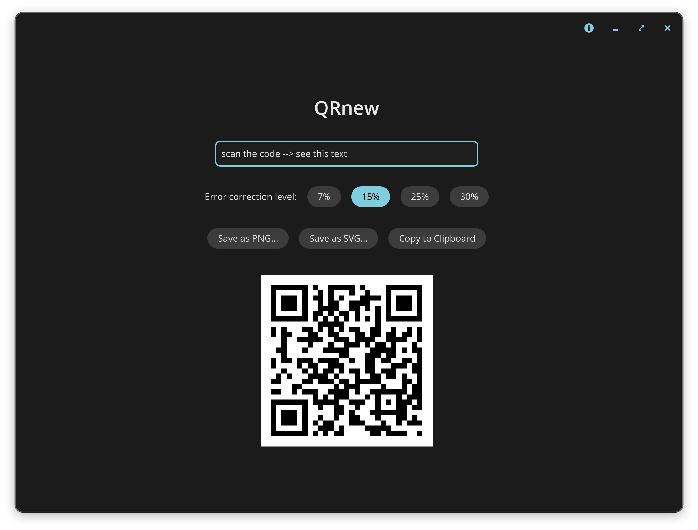

# QRnew

Local-only QR code generator

Small, simple, and and offline-only, so user data remain private. Create a QR code immediately, then save it as PNG or SVG. You can also copy it, or scan it directly from screen.

## Installation

Go to [Releases][releases] and download the asset for your operating system, then double-click to unpack.

> **macOS first launch:** macOS will block the app because it is not notarized. After the warning appears, open *System Settings → Privacy & Security*, scroll down to the *Security* section, and click *Open Anyway*.

## Acknowledgements

QRnew is based on [libcosmic] and the [qrcode] crate. It was inspired by [qrrs], a CLI frontend for qrcode.

[releases]: https://github.com/lhdjung/QRnew/releases
[libcosmic]: https://github.com/pop-os/libcosmic
[qrcode]: https://crates.io/crates/qrcode
[qrrs]: https://github.com/Lenivaya/qrrs
