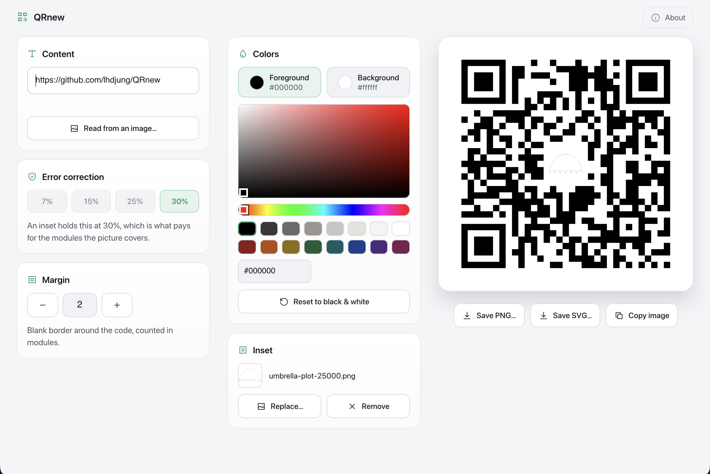

# QRnew

Local-only QR code generator

Small, simple, and and offline-only, so user data remain private. Create a QR code immediately, then save it as PNG or SVG. You can also copy it, or scan it directly from screen.



## Installation

Go to [Releases][releases] and download the asset for your operating system, then double-click to unpack.

> **macOS first launch:** macOS will block the app because it is not notarized. After the warning appears, open *System Settings → Privacy & Security*, scroll down to the *Security* section, and click *Open Anyway*.

## Dev build

Building from source needs the [Rust] toolchain, plus the development headers for `libxkbcommon` on Linux or the Xcode command line tools on macOS. [just] is optional, and only carries the packaging recipes.

```sh
git clone https://github.com/lhdjung/QRnew
cd QRnew
cargo run     # debug build, quickest to iterate on
just run      # release build, what a user would get
```

The QR pipeline lives in the `qrnew-core` crate and is tested on its own, without a window:

```sh
cargo test -p qrnew-core
```

Those tests render each style and read it back with a real decoder, so a change that quietly breaks scannability fails rather than merely looking odd. To look at the styles instead, this writes one PNG per combination:

```sh
cargo run -p qrnew-core --example gallery -- some/directory
```

Packaging is `just bundle-macos`, `just bundle-linux` or `just bundle-windows`, each run on the platform it names. The macOS and Windows recipes need ImageMagick (`magick`) on `PATH` to convert the icon.

## Acknowledgements

QRnew is based on [libcosmic] and the [qrcode] crate. It was inspired by [qrrs], a CLI frontend for qrcode.

[releases]: https://github.com/lhdjung/QRnew/releases
[Rust]: https://rustup.rs
[just]: https://github.com/casey/just
[libcosmic]: https://github.com/pop-os/libcosmic
[qrcode]: https://crates.io/crates/qrcode
[qrrs]: https://github.com/Lenivaya/qrrs
